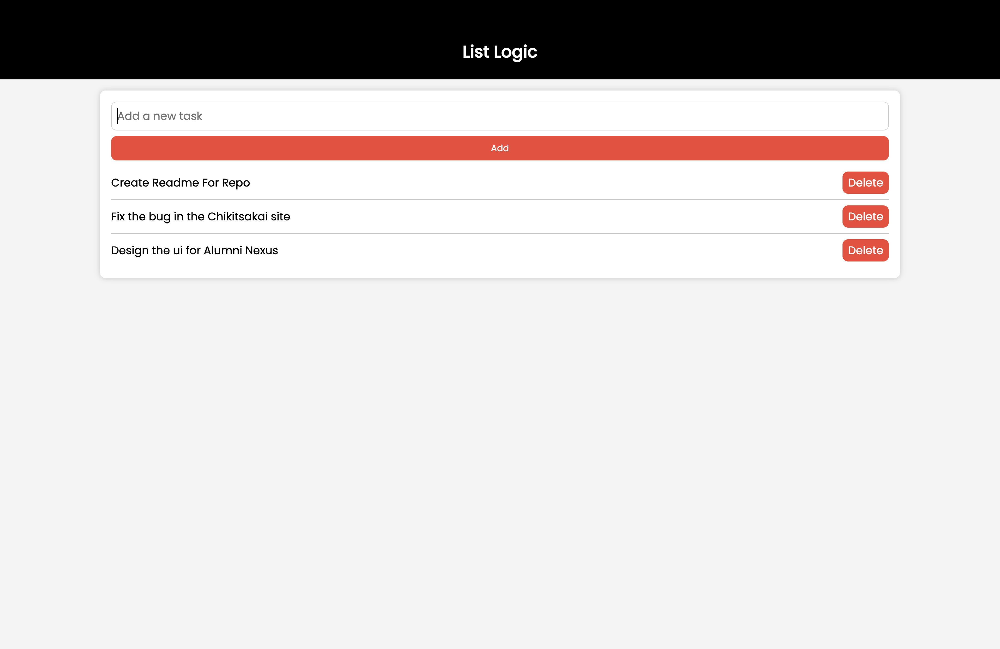

<h1>List Logic</h1>

List Logic is a sleek, user-friendly todo list app crafted with HTML, CSS, and JavaScript. Streamlining task management, it offers an intuitive interface for creating, organizing, and completing tasks. With a clean design, it enhances productivity, making daily planning a seamless experience.
<h2>Technologies Used</h2>

<ul align="center">

 
</ul><h2>Features</h2>

<ul>
<li>Local Storage</li>
</ul><h2>Screenshots</h2>

<h2>Project Status</h2>

The project is completed and is already deployed.
<h2>Improvements</h2>

<ul>
<li>Better UI</li>
</ul><ul>
<li>We can add search feature for the ToDO's</li>
</ul><h2>Features that can be added</h2>

<ul>
<li>Cloud based storage can be added</li>
</ul><ul>
<li>Data sync across multiple devices with cloud sync</li>
</ul><h2>Contact</h2>

